# Баним рус нет
## Установка
- Врубаем vpn/proxy 
- Регистрируемся на [гитхабе](https://github.com/signup?ref_cta=Sign+up&ref_loc=header+logged+out&ref_page=%2F&source=header-home) 
- Форкаем [этот репозиторий](https://github.com/monkerzhe/SlavaUkraini).
 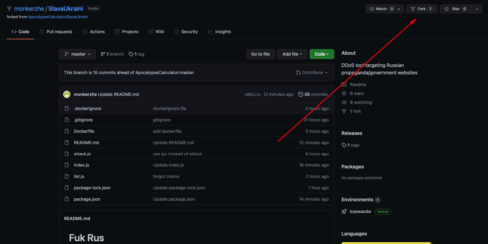  
- Регистрируемся на [хероку](https://signup.heroku.com), технология node js при реге (вообще пофиг)
- Создаем новый проект, пофиг на название
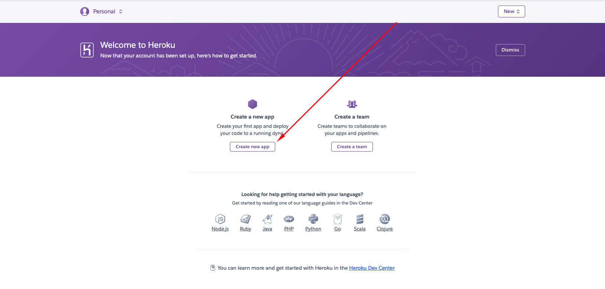 
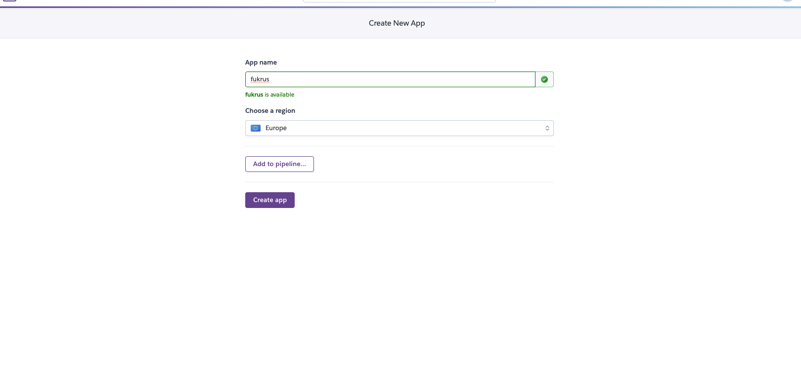
- Коннектим гитхаб
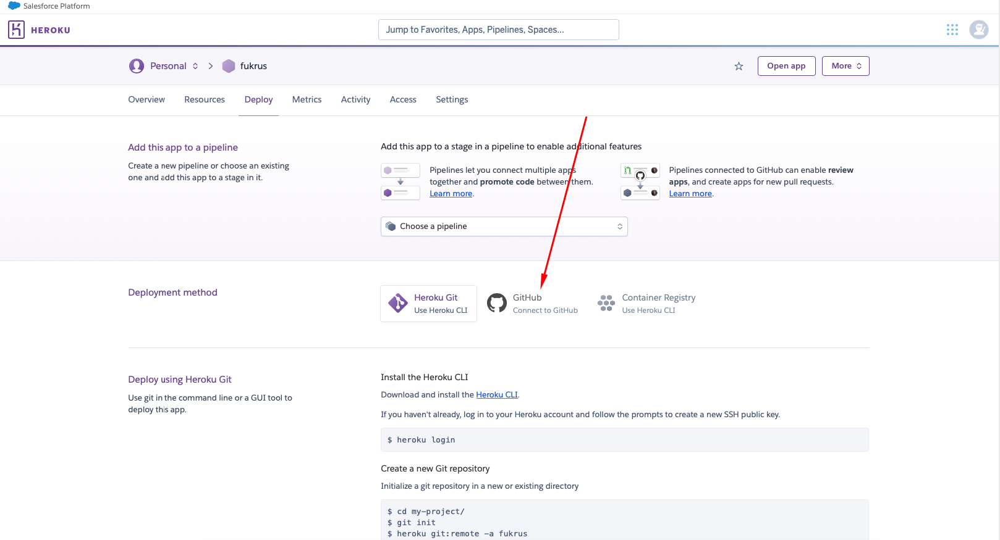
- вводим SlavaUkraini
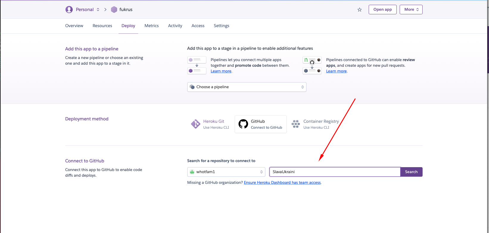
- нажимаем connect
  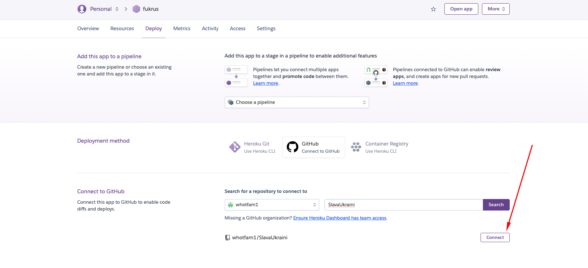
- включаем автодеплой
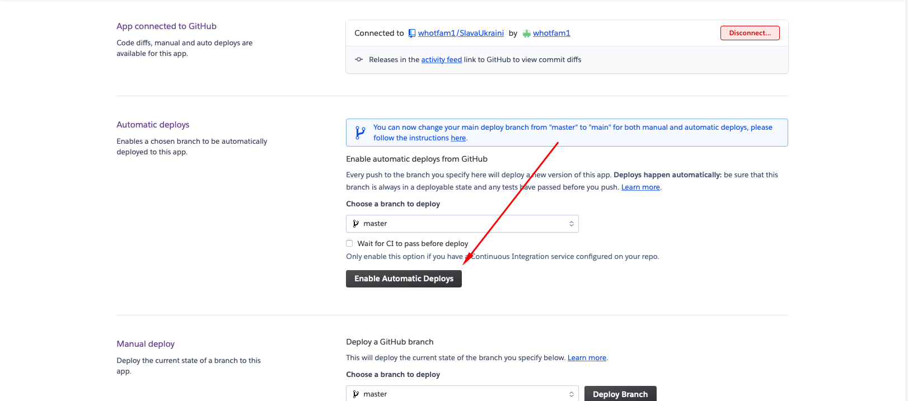 
- деплоим

- Переходим на [сайт](http://kaffeine.herokuapp.com/)
- Вводим название проекта, снимаем галочку, нажимаем ок
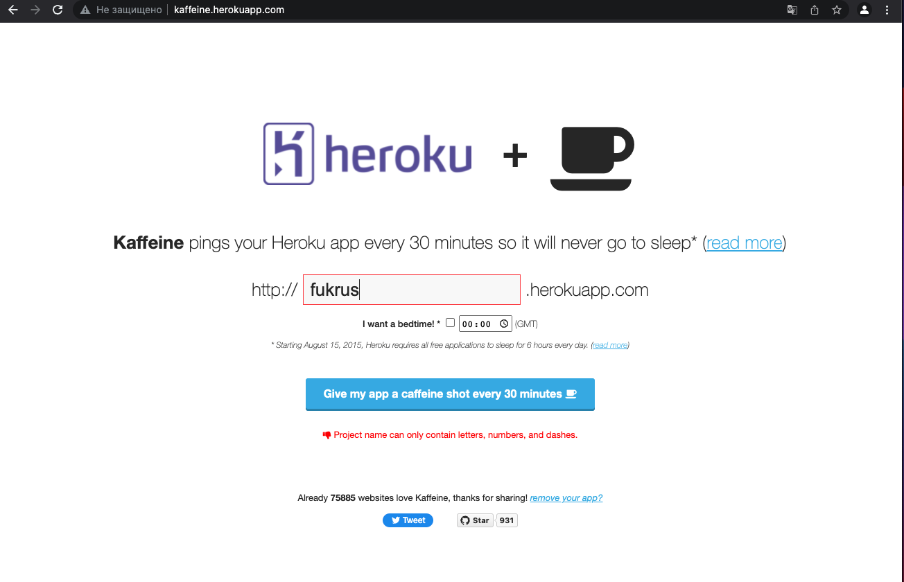 
- Повторям сколько душе угодно раз,можно запускать локально
- Результат
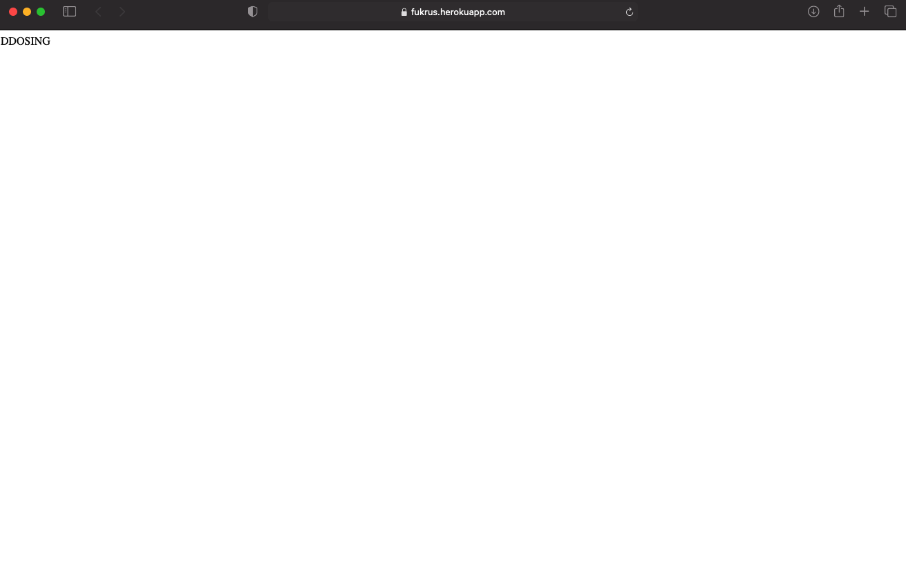 

# Локально если умеете пользоваться нодой и терминалом
- устанавливаем [node js](https://nodejs.org/en/)
- клонируем/скачиваем проект
- заходим в него,открываем терминал
- npm i && npm run start
  - Что б закрыть жмем ctrl + c и потом в консоль пишем killall -9 node
  P.S npm run start можно заменить кастомной командой. В корне проекта node . --workers=20 --silent
  --workers : количество воркеров -> чем больше число, тем сильнее атака
  --silent: убирает лишние выводу в консоль

# Апдейт сайтов которые ложим
- Заходим на [гитхабе](https://github.com/) в проект
- Находим файл list.js
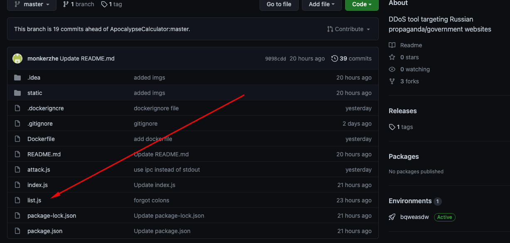 
- Нажимаем на кнопку ручки(редактировать)
  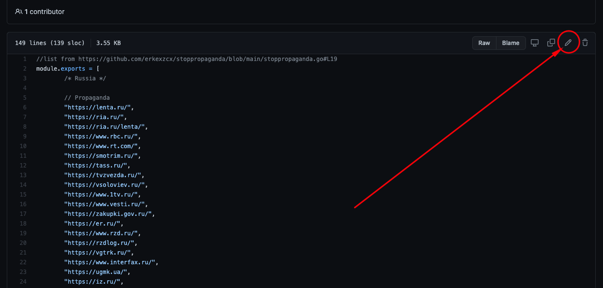
- Добавляем ссылки на сайты (Пример: "https://lenta.ru/",). Важно: должны быть кавычки и запятая в конце "https://lenta.ru/",
  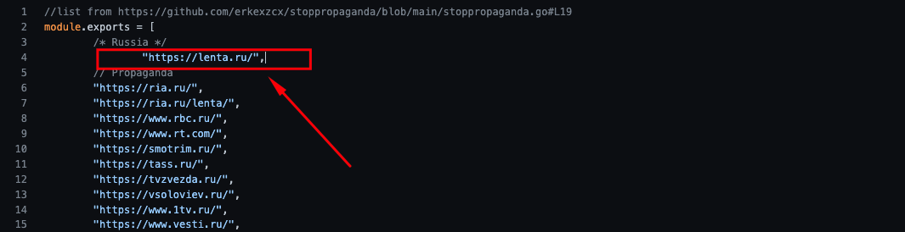
- Нажимаем на кнопку сохранить, автодеплой сам все обновит
  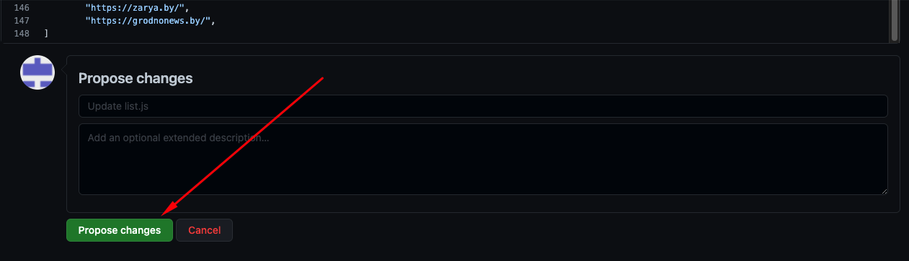
- Наслаждаемся результатом

P.S картинки в репозитории,можете смотреть если что-то не понятно
